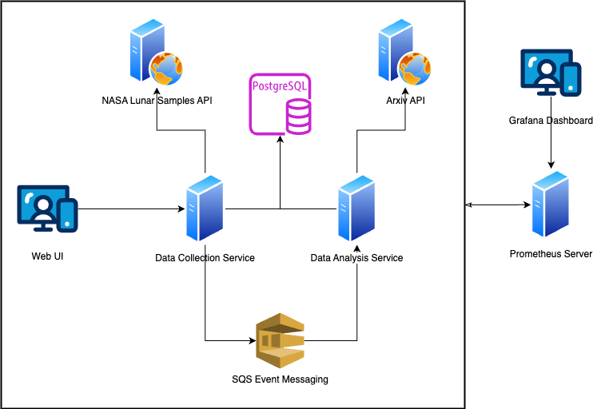

## High Level Application Description

My project, NASA Research, is composed of;
- two python services (data collection and data analysis)
- a react/typescript webapp
- event messaging
- PostgreSQL database
- prometheus monitoring
- grafana analytics dashboard

The application collects data from the NASA Lunar Samples API and links all the objects (Missions, Landmarks, Stations, Samples, Sample Display's) to the mission that they are associated with. The data is stored in a PostgreSQL database. 

There is also a separate service that runs in parallel that performs analysis on the Lunar Samples data and also queries the Arxiv API for documentst that are related to the Mission. This service also performs more analysis on the data collected from the Lunar Samples API by gathering metrics on the data in the database (ex. count number of each of the objects).

To trigger analyzing and adding Arxiv documents, these two services communicate via SQS event messaging and utilizing the same PostgreSQL database. 

The data collector service first queries the Lunar Sample API and with each mission, the mission name is sent via a message and the data analysis service picks up the message off of the queue. Once the data analysis service has received the message it will do a lookup of the mission via its name from the database. The data analysis service, then queries the Arxiv API and updates the PostgreSQL database with a relationship between a Arxiv document and the mission.

The Web UI servers to give a user friendly interface in querying and interacting with the data.

There is also a Prometheus server and Grafana Web Dashboard running that monitors the health of the overall system.

There were a few architectural decisions that were made throughout the development of the application. First of which was to use PostgreSQL as the database technology. The data that I am working with has a very clear structure and clear relationships between objects. This allows for defining a clear database schema. I chose PostgreSQL over other SQL technologies because I am most familiar with its apis and configuration. 

Another decision was to break the data analysis service out of the data collection service. I made this decision to have a clear separation of concern between performing analysis and collecting data. Though the data analysis service does collect data from the Arxiv API it is to support and provide more information on the mission that has been already collected. I also wanted to reduce the load of work that the data collection service would be performing considering it also hosts the APIs that allow the Web UI to query for the Missions data. 

Some of the system requirements for the project were:
- System must have a easy to use Web UI
- System must utilize a database
- System must utilize event messaging
- System must collect data from web API
- System must include monitoring
- System must have a database schema
- etc.

Some of these requirements, such as "having a easy to use Web UI", were testable via manual interaction with the application. Others were testable via automation. For instance, I have integration tests that test the integration of the data collection service and the database, with mocked responses for the web API. This also covers the requirement to utilize a database. Other testing that could be implemented is end-to-end testing that could cover a users interaction on the frontend that triggers the collection service to fire off an event message and seeing that the analysis service picked up the message and the database was updated with a new entry. We could also test the resiliency of the system with loading testing by simulating a large volume of user interactions and api requests to see how well the system handles changes in user load. 